# 回应readme声明 2026-04-28

应**当事人自己强烈要求**，回应此事。issue 里似乎被带歪太多了，感觉回 issue 的许多人自身也不清楚全过程（甚至连当事人也装作不知道此事👍一个劲的拐其他东西，也给你们恢复下记忆），事情也略有复杂，有必要梳理下。

我希望用尽可能少的文字，自洽且有逻辑地讲述过程，所以**我不希望这个声明以任何形式被总结和转述，也不希望出现在公共平台上（指B站等）**。**希望读者带有自己的思考。**

**请不要牵连除我以外的其他人员。**

### 本人要求
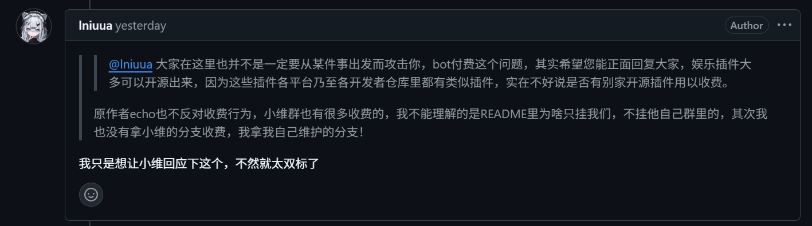

### 人物速查表

- **K**：kmnissy、爱吃雪糕、岸宝 Bot 主人、Iniuua、shixu、<https://www.kokos.icu/>
- **M**：moonshadow、磨山者、彩虹猫、MoonShadow1976
- **F**：芙檁（经典人物）
- **E**：本仓库原始开发者（由于已被 **M** 在 issue 里提及，不可避免地提到），在正文中打码处理
- **我**

PS：此处「岸宝」仅指 kokos.icu 中提及的 Bot，仅指一人，无关 守岸人 角色形象和其他同名Bot及部署者。

### 主要部分：完整事情流程

背景：插件从前代起就具有开发群，部署插件需要在**E**的群内获取token并留在群内。

#### 一

25年早些时候，**M**入群，fork了仓库，提供了基于OCR的部分国际服功能。此后某一时间，**M**由于不明原因退群。

#### 二

10月时，我注意到discord社区的**F**宣发Bot并疑似宣称独立开发圈钱，而其支持的国际服疑似使用**M**的工具。但此时尚未确认。

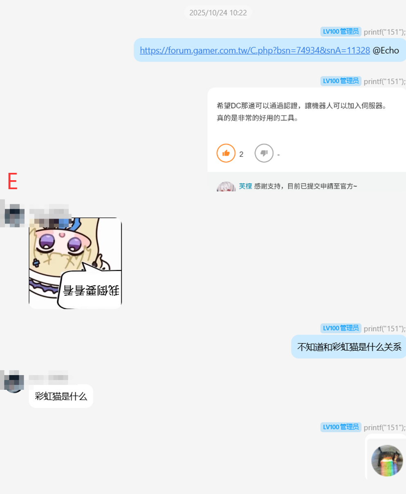

#### 三

为了确认是否出现了新的分支，以及退群的**M**是否与此人共享代码，11月时，在2.8版本千咲的伤害计算中，我留下了明显的伤害计算错误，并提交到**E**的仓库，具体错误可以追溯过往插件代码。此错误成功同步到了**M**以及**F**的代码中，并直到其被用户提醒才发现。此时可以确认**F**的确同步了**M**的代码，但还不能确认存在合作关系。

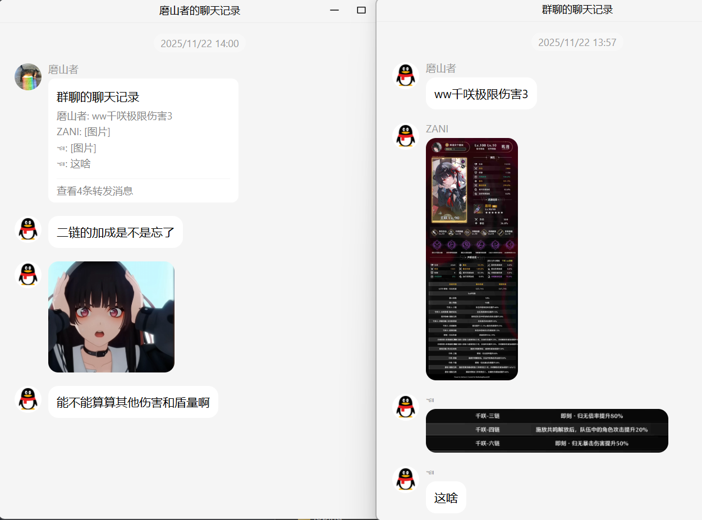

#### 四

应该是最经典的部分，wwuid史上最黑暗的一天。由于**F**的行为过于嚣张，长期声称自己是本项目唯一开发者并以此为由索取费用，原开发者**E**表示恶心，继而删库终止维护，此事在https://ngabbs.com/read.php?tid=45654606 ，此事直接导致期间鸣潮持有率数据归零。**F**甚至根据代码更新，伪装了工作进度，多次强调“只有我一人开发”卖惨。注意：此前已经确认**F**同步了**E**的仓库所有代码，甚至没有检查。

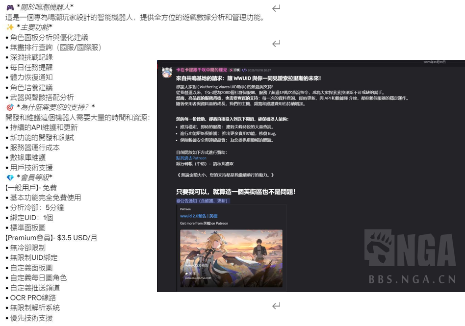

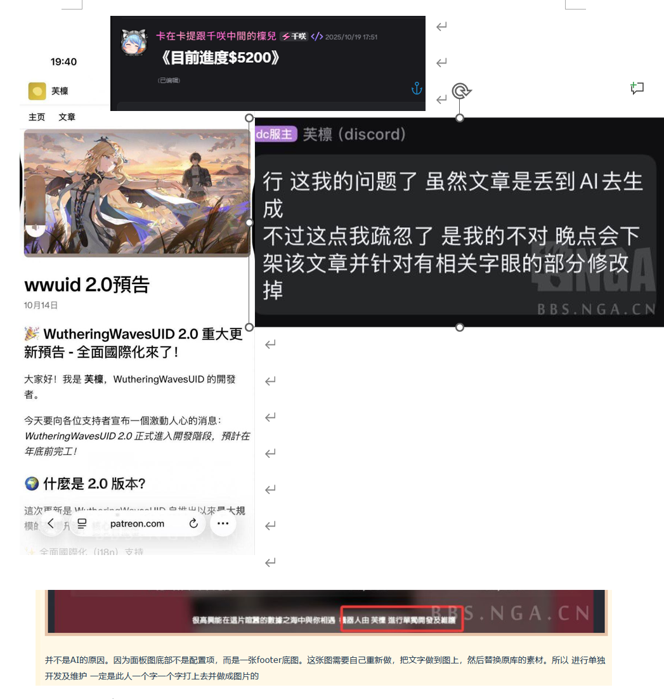

#### 五

删库后，**M**找到**E**，根据以下完整记录，进行的合理结论是：**M**了解**F**的“开发过程”，甚至进度细节，足见其关系密切。简言之：**M**与**F**具有明显的合作关系，而**M**明知作者是**E**的情况下，仍然与**F**合作，支持**F**自称是作者圈钱的行为。**F**的行为不是偶尔，而是持续至少数月，最早能找到8月的记录，与**M**退群时间接近，**M**在了解如此多信息的情况下不可能“没注意到”。所以：**M**与**F**的合作关系是明确的，而**M**的态度是支持**F**的行为（指冒充原开发者，编造更新日志抢夺他人一切劳动成果，并使用抢夺的劳动成果欺骗他人钱财）的。

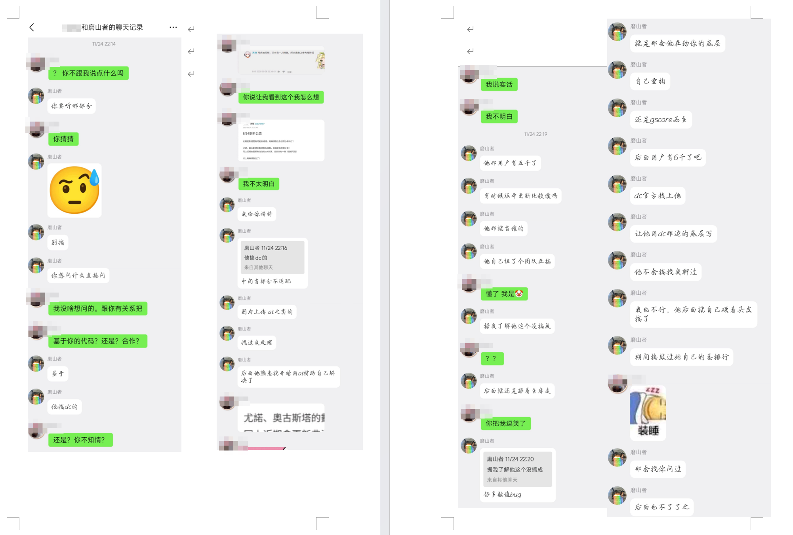

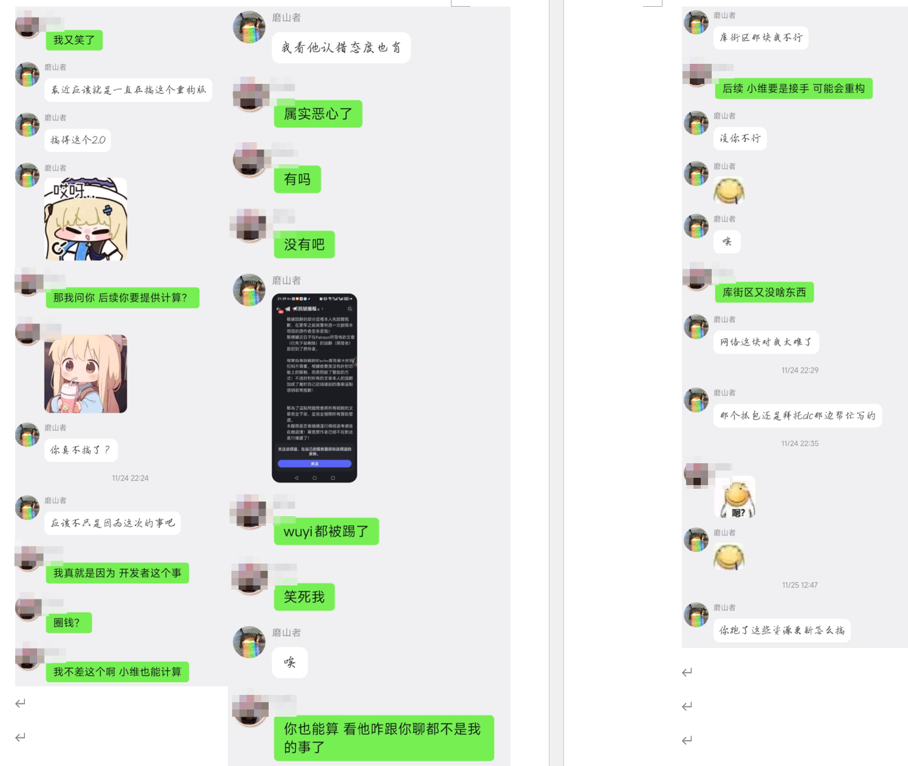

而：图穷匕见的嘴脸，更是令人反感。我认为人类都能看出：你不跟我说点什么吗？是想听什么，但是等来的却是：

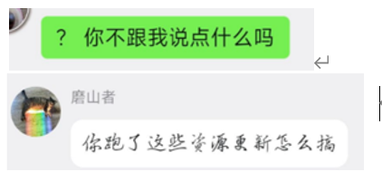

#### 六

**K**和**M**的合作。谁找谁的不得而知，但是既然这俩人骂我的时候都是一起出现的，感觉也不用证明了。然而，如果**K**是一位正常的开发者，还有可能是不了解原委而被骗的，但**K**是何人呢，人品展示：

将 你已急哭 的嘲讽当作善意的恶搞，哈哈（PS：本仓库不做自动刷新是因，如果做所谓的“自动刷新”，则往往需要对比词条才能知道实际刷新了没有，权衡之下并不易用。）

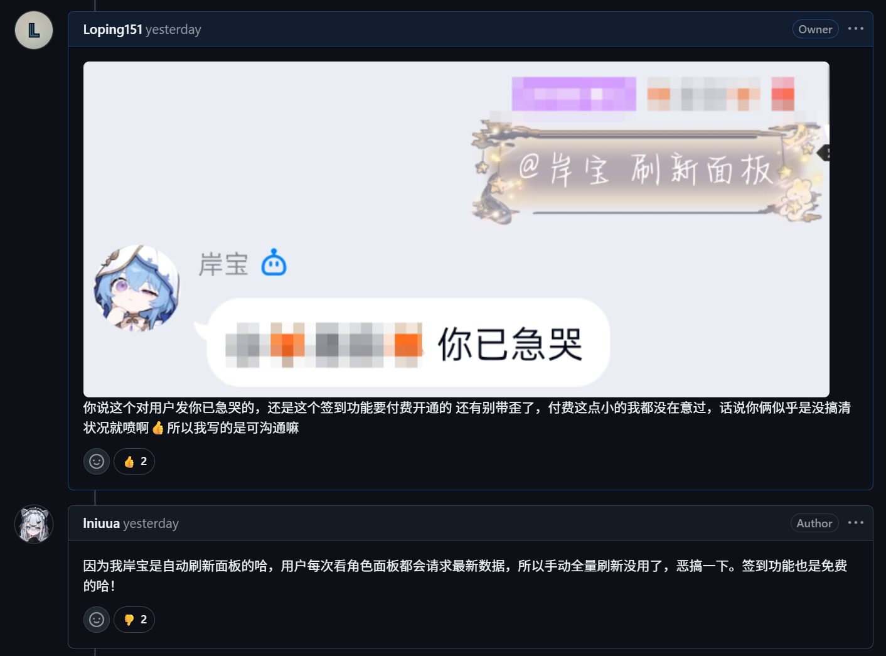

连续输出fw，如果对方不乐意还要指责对方玻璃心（见issue）。注意下图不是拼图，而是搜索结果中连续的聊天记录。

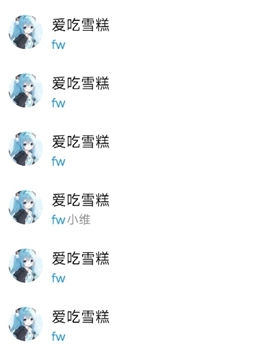

[关键] 指责开源，但自己从不开源，自己的“分支”至今未曾对外公开，且在**E**开源时期，表示想加密自己bot的用户数据，此举会导致如果登录了他部署的bot，则不再能和其他bot共享登录（原本插件提供了token登录方式共享登录）。

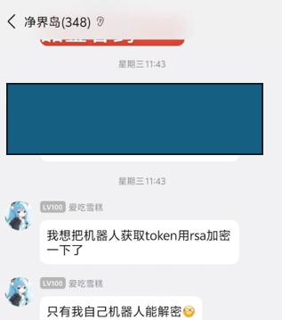

[关键] 监控其他的插件部署者，对于一个三句话离不开钱的人，目的我觉得不需要多说吧。

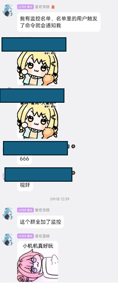

还有用盗版跳脸正版玩家这些常规操作之类说是

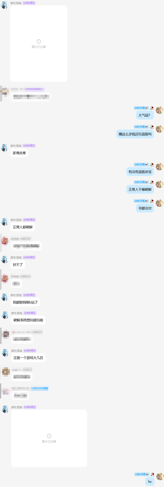

有点多，先放这些吧。**K**是开发群老群员，不可能对**M**、**F**的行为毫不知情，**K**的行为也表明了其态度和目的。

此部分结论为：**K**和**M**合作的目的是继续排斥其他部署者，对于开源内容进行“垄断”。**K**的行为虽然与**F**有别，但其毫不犹豫地和**M**展开合作足以说明其目的和态度与**F**别无二致。

综上，我的结论是上述人员是**开源社区的敌人**，此事与收费等没有任何关系，而是开业社区的问题。我是人类，我自然带有个人情绪，但是我暂时觉得结论没有太大的问题。

以下是对方对我的直接回应：

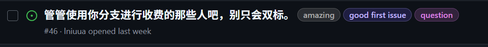

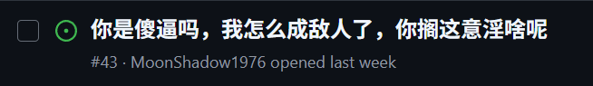

PS：上面两个发生于本声明以前。查看history可知readme长期挂着这些人且**M**早已知晓此事，所以readme也不是直接原因，可想而知选择此时突然开骂还另有所图。

**M**是AstrBot主仓库的贡献者。我为AstrBot产生了此等人员深表遗憾，并衷心希望因我此举能让AstrBot不会因此人产生一位非简中社区的Astr“独立开发者”。

#### 次要部分，碎碎念

##### 先回答次要问题：

1. 关于issue里提到的我的收入：我个人不存在任何收费行为，所以来自插件的总收入是0。3r/g的代理池，我不是网络专业人士，也并没有什么特殊渠道，了解隧道代理行情的读者应能理解，3r/g没有利润空间，但是既然你提了，我选择将这部分钱直接往开发者群里发放返还，并后续自费为正常的部署者提供支持。目前，没有任何部署者将任何收费分成给我，因为我坚持本插件提供的工具服务应是免费的。部署插件，包括图像识别所用的机器、域名、云服务器等是出于我个人爱好，虽然耗费十万余元，但并非专供本项目，也用于我自己的Bot运行，所以不算入成本。

2. 我说了这么多了，如果还以 收费 相关问题进行回应，我不能接受。

3. 关于 “什么都要审核”：

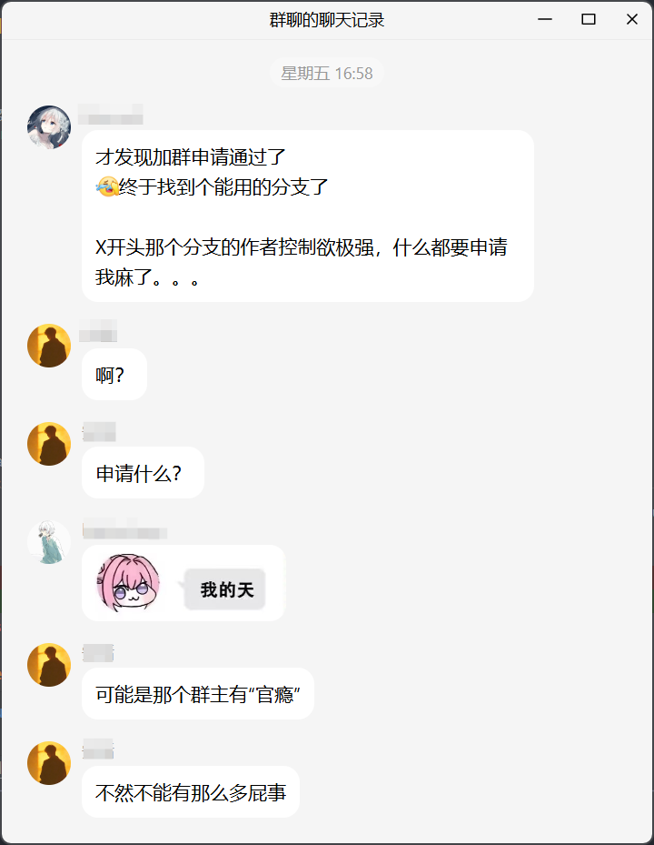

这部分已经在readme中写清。本插件需要“申请”的内容仅有一个，就是接入总排行的token，这是为了避免被恶意上传，污染数据库。而token实际上是自助获取后通知我即可。至今，0个正常申请token的人遇到了申请失败，0个人由于和我的矛盾被禁用token。简单来说，token保护的目的不是 让谁用，而是 不让谁用。再说明白点，就是避免你们这样的人使用。评分服务不在本仓库下，是另外的token是因为当我做完评分服务时我还没有接手本插件。申请步骤是：和我说一声，熟悉我的人都知道，我连点star的小要求都不会仔细检查。我自费提供了R9 9950x和预留了RTX 3090部分性能专门用于处理图像识别和评分计算，然而被宣传为“官瘾”。

##### 补充一下次要细节：

我在readme做过几次试探，比如下图所示的部分：

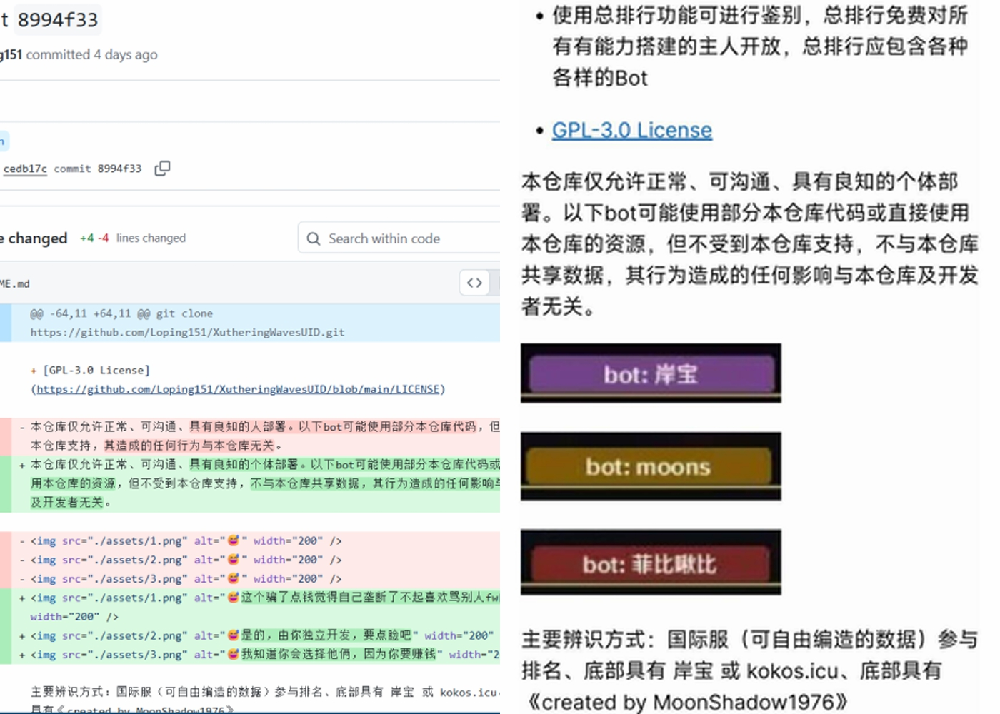

为什么说这是试探呢，了解前端的人很容易能理解：alt这个字段是不会直接显示出来的（如右图），如果有人看到了这个，可以说明此人阅读了仓库的更新记录，一般只能在diff里发现。而：

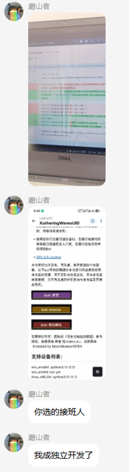

还有**K**惊为天人的给开源作者credit的方式，就是既不放github仓库link，也不放作者link，甚至放的不是作者的github id，而是其QQ常用昵称，你放这个是给我看的？

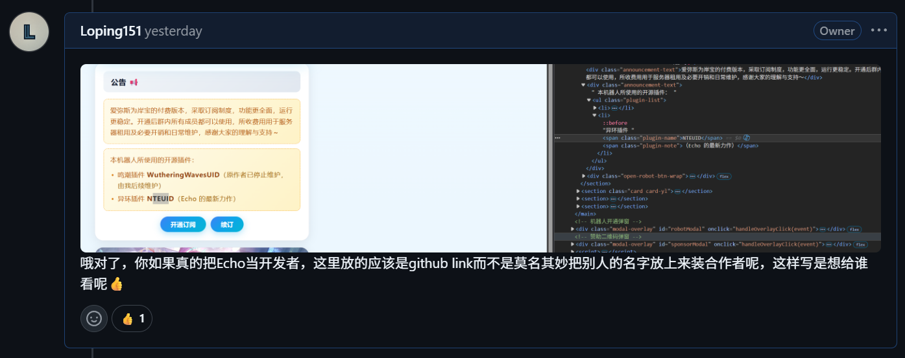

我明白许多人不理解事情原委，知晓者多数短短半年也已经遗忘，后来者也不知晓。本声明的目的是依据对方要求进行回应，并留下完整记录。

虽然我肯定不是什么十全之人，但我也并不是小家子气，即使我在刚开始觉得有问题的时候就开始收集素材和试探收集证据，我也没有主动发布。但是贴着脸骂我要求我公开，我认为我不得不这么做。我为开源社区深感遗憾。我难以想象一个做出此举的人（**M**）竟然还能一口咬定自己与事件毫无联系，装作没事人一样偷换概念唆使其他人继续指责我，并将矛盾转移至 收费问题和“排斥不使用自己分支的人”，摇身一变成为无辜者。你们令人气愤，令人失望，令人作呕。